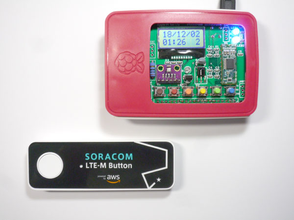

# aws_iot1click_lambda × Apple Pi

* aws_iot1click_lambda を ビットレードワン製 ApplePiと連携させます。

* 以下のような動作を行います。

    ボタン操作　　：ApplePi
    クリック　　　：LCDへ[1]の表示、LED点灯数＝1個  
    ダブルクリック：LCDへ[2]の表示、LED点灯数＝2個  
    長押し　　　　：LCDへ[0]の表示、LED点灯数＝0個  

## ステップ1

* Raspberry Piの設定ツールを起動する
    sudo raspi-config
* I2Cの有効化 [5]→[P5]→有効化

## ステップ2

* i2c-toolsをインストールする（不要かも）
    sudo apt-get install i2c-tools

## ステップ3

* CQ出版社のサイトからApplePi専用ライブラリをダウンロードして展開する

    wget https://toragi.cqpub.co.jp/Portals/0/support/2016/201608ApplePi/ApplePi.tar
    tar xvf ApplePi.tar

* 必要ファイルとフォルダ（ディレクトリ）構成は以下のようになる

    aws_iot1click_lambda  
    ├── ApplePi  
    │   ├── display_ambient.py  
    │   └── ApplePi  
    │        ├── initLCD.py  
    │        ├── locateLCD.py  
    │        ├── offLED1.py  
    │        ├── offLED2.py  
    │        ├── onLED1.py  
    │        ├── onLED2.py  
    │        └── printLCD.py  
    └── display_ambient.py (ApplePiなしで動作確認)  

## 参考文献
* トラ技2016年8月号 P.129
* ビットレードワン  
http://bit-trade-one.co.jp/product/module/adcq1608p/
